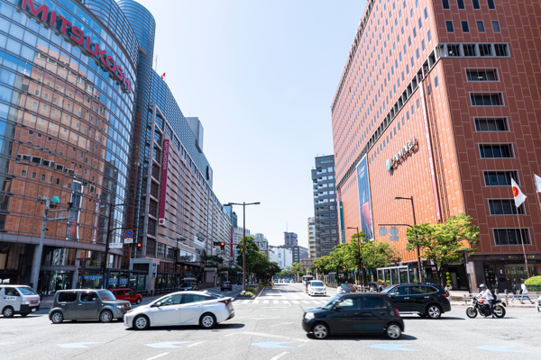

# 使い方

## [DermAnnotation](https://kondoa9.github.io/DermAnnotation/en/)
で作成されたTIFF画像を開き，各フレームのラベルを取得
```py
from derm_tiff import load_image

derm_image = load_image("example/imgs/input.tiff")
labels = derm_image.labels
print(labels)  # ['Pencil1', 'Pencil2', 'Pencil3']
```

## TIFF画像の各フレームのマスクを合成して出力
```py
for label in labels:
    img = derm_image.get_annotation_image([label], alpha=0.5)
```



## 新たにフレームを追加
```py
import numpy as np

H, W, _ = derm_image.shape
new_label = "new label"
new_mask = np.random.randint(0, 2, (H, W), dtype=np.bool_)
new_color = (255, 255, 0)
derm_image.add_frame(new_label, new_mask, new_color)
```

## DermAnnotationで開けるTIFF形式で保存
```py
derm_image.save("example/imgs/output.tiff")
```

## 全体でリサイズも可能
```py
resized = derm_image.resize(300, 200)
```